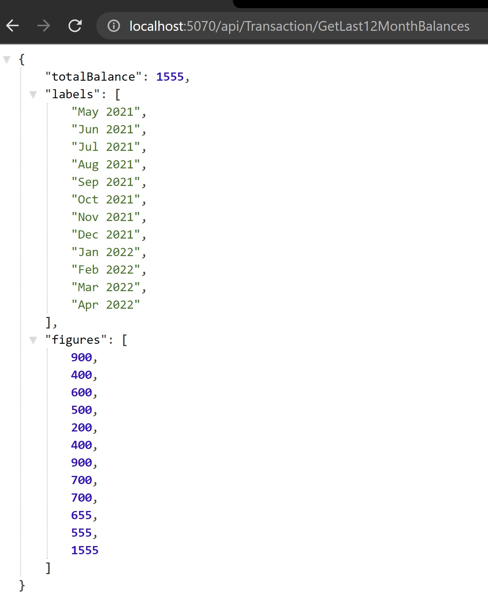

# **Custom Validation With Debounce Pattern** 

## **What is a Validation?**
Angular uses **directives to match the attributes with validator functions** in the framework. Every time the value of a form control changes, **Angular runs validation** and generates either a list of validation errors that results in an INVALID status, or null, which results in a VALID status. **A validator is really just a function that takes a Control**.

We can implement our own validators which we call custom validators using the below mentioned steps 
* To implement a custom validation directive, we need to **implement the Validator interface**, which only has the validate method
* The validate method is going to **call the validation creation function, and pass the control reference  to the validator**
* The validator will return **null if the control is valid or a ValidationError error object otherwise**

## **What is Debounce Pattern?**
The Debounce Pattern **debounce the delay of a function/method execution or an action for a period of the specified time**. During this specified time, calls to the method/function or action are collected and **executes when the specified has elapsed**.

### **Case Study**
Suppose you have a banking application where an **admin wants to register a new user**. Admin will fill the form with account number in it. So, before submitting this request the magic of debounce pattern will come in act to **make sure the account number is unique**.

We will implement a custom validator with debounce pattern for the above case study    

---------------

## About this exercise
In this lab we will be working on two code Bases, **Backend Code base** and **Frontend Code Base**

## **Backend Code Base**
### Previously 
We developed a base structure of an API solution in Asp.net core that have just two api functions `GetLast12MonthBalances` and `GetLast12MonthBalances/{userId}` which returns data of the last 12 months total balances in a `TransactionController`.




There are 4 Projects in the solution. 

*	**Entities** : This project **contains DB models** like User where each User has one Account and each Account can have one or many Transactions. There is also a Response Model of LineGraphData that will be returned as API Response. 

*	**Infrastructure**: This project **contains BBBankContext** that service as fake DBContext that populates one User with its corresponding Account that has three Transactions dated of last three months with hardcoded data. 

* **Services**: This project **contains TransactionService** with the logic of converting Transactions into LineGraphData after fetching them from BBBankContext.

* **BBBankAPI**: This project **contains TransactionController** with 2 GET methods `GetLast12MonthBalances` & `GetLast12MonthBalances/{userId}` to call the TransactionService.


For more details about this base project See: https://github.com/PatternsTechGit/PT_ServiceOrientedArchitecture

-----------

## **Frontend Code Base**
### Previously 
We scaffolded a new Angular application in which we have integrated 

* **FontAwesome** library for icons
* **Bootstrap library** for styling.
* **Bootstrap toolbar**


_____________

## **In this exercise**

**Backend Code**
* We will **create an account service**  and a contract for this service in the **Service** project 
* We will **register this service in a pipeline** as scoped 
* We will **create an account controller**  with method **AccountNumberExists(string accountNumber)**
* We will **add some fake accounts** 

**Frontend Code**
* We will **create an account service** 
* We will **create custom account number validator directive**  
* We will **add a template driven form** in the HTML file of appComponent 

## **Backend Implementation**
Follow the below steps to implement backend code for custom validation with debounce pattern 

### **Step 1: Create a Service and its Contract**
Create a new file in ***Contract folder*** in ***Service library*** in our solution and name it `IAccountService.cs`. We will create an interface ***IAccountService*** and define a signature for ***AccountNumberExists*** as given below

```cs
   public interface IAccountService
    {
        public bool AccountNumberExists(string accountNumber);

    }
```

Now create another file in ***Service library*** and name it `AccountService.cs` in which we will create a class  ***AccountService*** which will implement `IAccountService`. Also, we will inject `BBBankContext` in this service. The method ***AccountNumberExists*** will take account number as an input and will return true if the account number exists in the context, false otherwise. The code is given below

```cs
   public class AccountService : IAccountService
    {
        private readonly BBBankContext _bbBankContext;
        public AccountService(BBBankContext BBBankContext)
        {
            _bbBankContext = BBBankContext;
        }

        bool IAccountService.AccountNumberExists(string accountNumber)
        {
            try
            {
                return _bbBankContext.Accounts.Any(x => x.AccountNumber == accountNumber);
            }
            catch (Exception)
            {
                throw;
            }
        }
    }
```

### **Step 2: Register Service in a Pipeline**
We need to **register the service** in the pipeline in the `program.cs` so that entity framework core may deal it as a dependency injection to use this. We will **use scoped lifetime** to ensures that all the service created within the request shares the same DbContext. The code is given below

```cs
builder.Services.AddScoped<IAccountService, AccountService>();
```

 ### **Step 3: Create a Controller**
 Create a new API controller in our startup project and name it `AccountController`. Als, create its constructor in which we will inject ***IAccountService***. Now, create a method `AccountNumberExists(string accountNumber)` which will call the service method to check whether the account number exists or not and return the response as an ***OkObjectResult***. The code is given below

 ```cs
    [Route("api/[controller]")]
    [ApiController]
    public class AccountController : ControllerBase
    {
        private readonly IAccountService _accountService;
        public AccountController(IAccountService accountService)
        {
            _accountService = accountService;
        }

        [HttpGet]
        [Route("AccountNumberExists/{accountNumber}")]
        public ActionResult AccountNumberExists(string accountNumber)
        {
            try
            {
                return new OkObjectResult(_accountService.AccountNumberExists(accountNumber));
            }
            catch (Exception ex)
            {
                return new BadRequestObjectResult(ex);
            }
        }
    }
 ``` 
We have also **defined attribute routing** for our controller and method. And, **used try catch blocks** to handle exceptions 

 ### **Step 4: Add Fake Accounts**
We will **add some fake accounts** in the context file so that we can test test our validator. Add the following code in the 'BBBankContext.cs' file 

```cs
 // initializing 24 new fake accounts.
            for (int i = 1; i < 25; i++)
            {
                this.Accounts.Add(new Account { Id = Guid.NewGuid().ToString(), AccountNumber = i.ToString() + "-xxx-xxx", AccountStatus = AccountStatus.InActive, CurrentBalance = i * 100, AccountTitle = "Fake Account " + i.ToString(), User = this.Users[0] });
            }
```

### **Note**
We will use the given route to get the response from the above method in a controller where ***0001-1001*** is an account number as a parameter  
http://localhost:5070/api/account/AccountNumberExists/0001-1001 

## **Frontend Implementation**
Follow the below steps to implement frontend code for custom validation with debounce pattern 

 ### **Step 1: Create an Account Service**
***Create an account service in the Service folder*** where we will make a HTTP call to server to get know whether the account number already exists or not.
Run the following command in the terminal to create a service  

```bash
ng generate service service/account
```
Now, We will ***inject HttpClient in the constructor*** to make a HTTP request. Create a function **AccountNumberExists(accountNumber: string)** which takes the account number as a paramter and will return the observable of type boolean as a response. The code is given below

```cs
import { HttpClient } from '@angular/common/http';
import { Injectable } from '@angular/core';
import { Observable } from 'rxjs/internal/Observable';
import { environment } from 'src/environments/environment';


@Injectable({
  providedIn: 'root'
})
export class AccountService {

  constructor(private httpclient: HttpClient) {}

  AccountNumberExists(accountNumber: string): Observable<boolean> {
    return this.httpclient.get<boolean>(
      environment.apiUrlBase + 'account/AccountNumberExists/' + accountNumber
    );
  }
}
```
### **Note**
Add ***AccountService*** in the ***providers*** array of `app.module.ts` as shown below 
```ts
  providers: [TransactionService, AccountService]
```

 ### **Step 2: Create a Custom Directive**
**Create a custom account-number-validator directive** which will acts as a normal validator directive on the input element which will ensure that account number is unique in the database. **Create a new folder *validators*** inside the app and create a new file `account-number.validator.ts` inside that folder. 
The code is given below

```ts
import { Directive, Input } from '@angular/core';
import { NG_ASYNC_VALIDATORS, AsyncValidator, AbstractControl, ValidationErrors, AsyncValidatorFn, Validator, ValidatorFn } from '@angular/forms';
import { map, Observable, of, switchMap, timer } from 'rxjs';
import { AccountService } from '../services/account.service';

@Directive({
  // this is the selector that will be used in Template on the felid where its required.
    selector: '[accountNumValidator]',
    providers: [{
        provide: NG_ASYNC_VALIDATORS, 
        useExisting: AccountNumValidatorDirective, 
        multi: true
    }]
})
export class AccountNumValidatorDirective implements AsyncValidator {
  // Injecting accountService since we will hit an api to check existence of an account number
    constructor(private accountService: AccountService) {  }
    // implementing AsyncValidator requires us to define a function called validate that either returns a promise or observable
    // This Promise or Observable is will return true if validation pass or ValidationErrors if validation fails.
    //control will have reference of control on which we applied the validator. 
    validate(control: AbstractControl): Promise<ValidationErrors | null> | Observable<ValidationErrors | null> {
      // passing the service reference and control to a function.
      return existingAccountNumberValidator(this.accountService)(control);
    }
  } 
  export function existingAccountNumberValidator(accountService: AccountService): AsyncValidatorFn {
    return (control: AbstractControl): Observable<ValidationErrors | null> => {
      let debounceTime = 1000; //milliseconds
      // rxjs timer Creates an observable that will wait for a specified time period, or exact date, before emitting the value
      return timer(debounceTime).pipe(
        // switch maps triggers value emotion when another observable emits a value. In this case switchMap will be triggered when timer will emit a value. 
        switchMap(() => accountService.AccountNumberExists(control.value)),
        map((response: boolean) => {
          // if api returns true which means account number existed in the database then a key value pair of error name (key) and value (true) will be returned
          // if api returned false we return null. 
          return (response == true ) ? { "accountNumberExists": true } : null;
        })
      );
    };
  } 
  ```
### **Note**
Add this directive in the ***declarations*** of the `app.module.ts` file as shown below 

```ts
declarations: [
    AppComponent,
    ToolbarComponent,
    AccountNumValidatorDirective
  ],
```

 ### **Step 3: Add a Template Driven Form**
We will **add a template driven form** in the `app.component.html` file which will have an input element for account number, an error message control and a button of type submit. **We have used two validators required and accountNumValidator**. The button will be disabled if the input field is empty or the account number already exists in the database. 

The code is given below
```html
<form style="margin-left: 20px;" #accountForm="ngForm" novalidate>
  <div class="row">
    <div class="col-6">
      <div class="card card-user">
        <div class="card-body">
          <div class="form-row row">
            <div class="col-12">
              <div class="my-1">
                <label for="accountNumber">Account Number</label>
                <input #accountNumber="ngModel" type="text" class="form-control" id="accountNumber"
                  placeholder="Account Number" ngModel name="accountNumber" accountNumValidator required />
                <!-- Using a custom Async validator accountNumValidator -->
              </div>
            </div>
          </div>
        </div>
      </div>
    </div>
  </div>

  <br>

  <div class="error-message" *ngIf="accountNumber.errors && (accountNumber.dirty || accountNumber.touched)">
    <p class="text-warning" [hidden]="!accountNumber.errors?.['accountNumberExists']">
      <b>Warning:</b> Account Number Already Exists.
    </p>
  </div>
  <!-- like we can track validation of individual forms we can also track validation of entire form -->
  <!-- Create buttons caus the form to trigger submit behavior but is disabled until entire form is in valid sate. -->
  <button [disabled]="!accountForm.form.valid" class="btn btn-danger btn-create btn-block" type="submit">
    Create
  </button>
</form>
```

### **Note**
Add ***FormsModule*** in the ***imports*** array of `app.module.ts` for template driven form as shown below 
```ts
  imports: [
    BrowserModule,
    AppRoutingModule,
    HttpClientModule,
    FormsModule
  ],
```


-----------
### **Final output will look like this**
When the account number already exists the custom validation  directive returns the error message and the form will looks like this  


